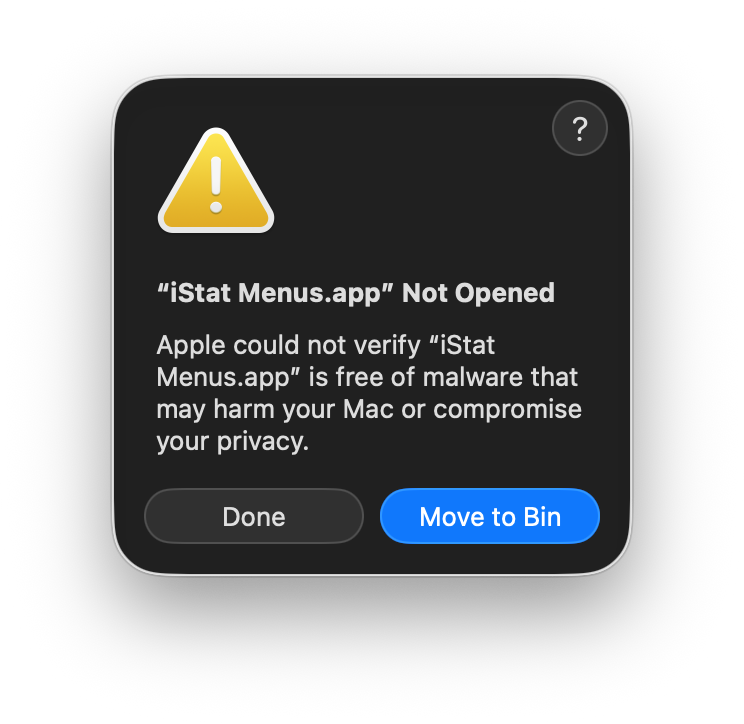
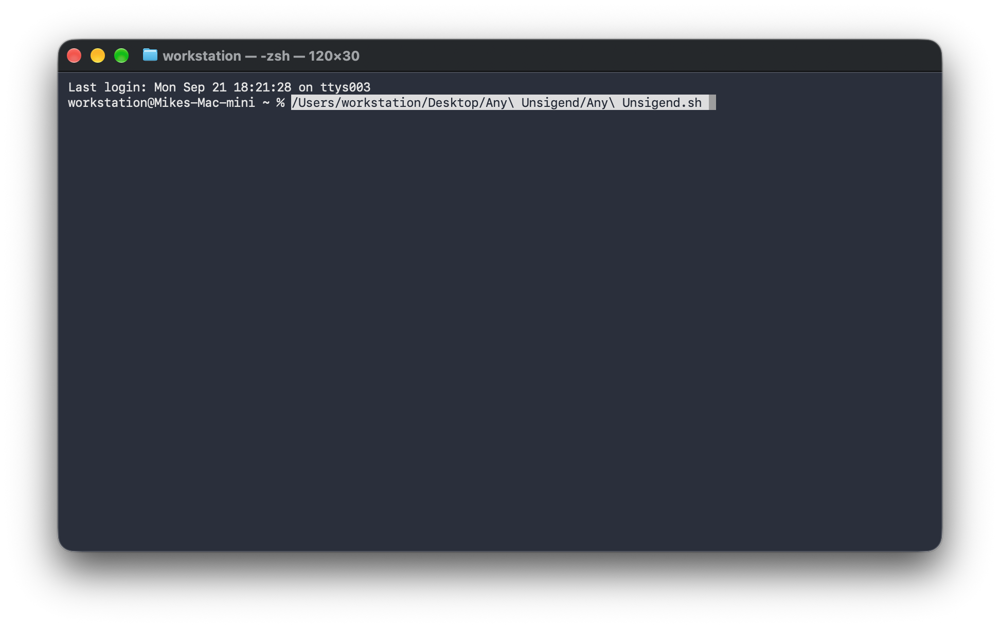
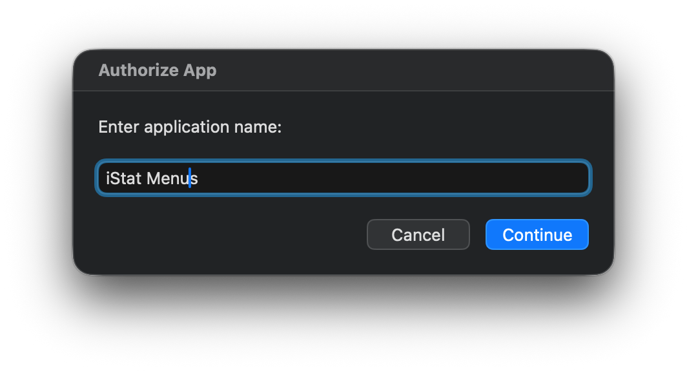
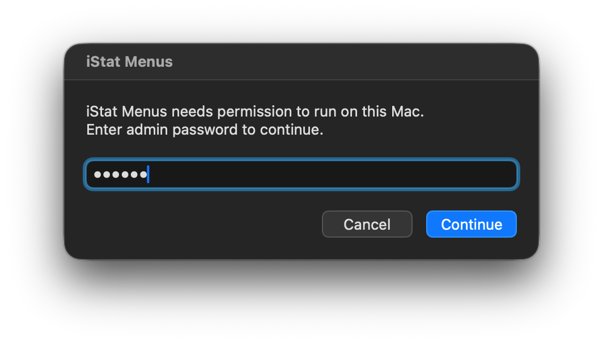
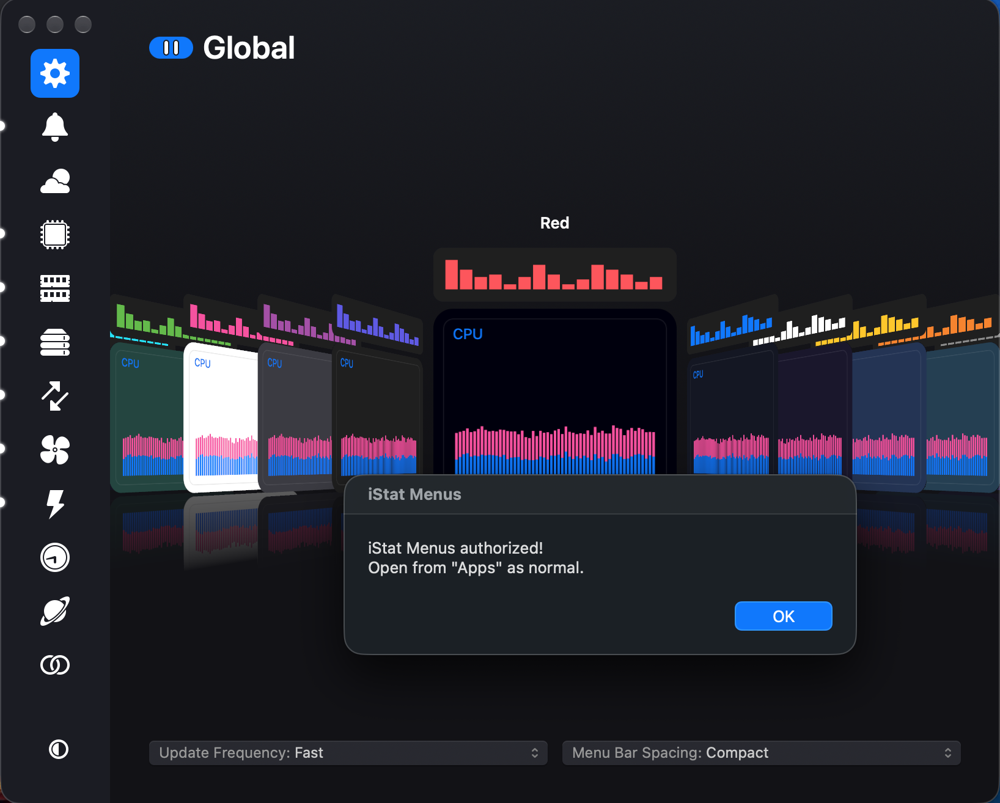
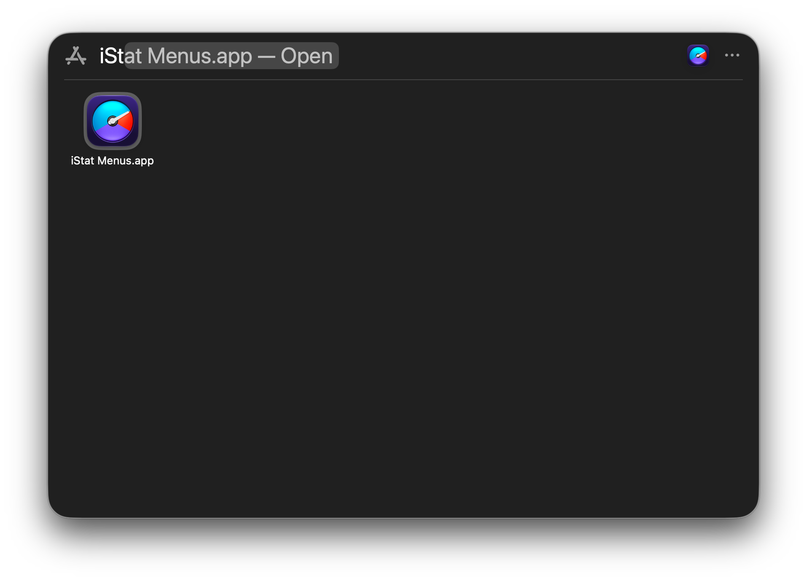

# Any Unsigned

A safe, targeted alternative to disabling macOS Gatekeeper globally.

## The Problem

When you download an application outside of the Mac App Store, macOS applies a quarantine flag to it. Rather than being upfront about this, macOS will falsely claim the app is damaged or corrupted — it isn't. This is a deliberate warning designed to discourage running unsigned software.



The common workarounds you'll find online are broad and risky:

```bash
sudo spctl --master-disable     # Disables Gatekeeper entirely for all apps
sudo xattr -cr /               # Recursively strips attributes system-wide
```

These commands lower your system's security posture permanently or indiscriminately. **Any Unsigned** solves this without the collateral damage.

## How It Works

It removes the quarantine attribute only from the specific application you name — nothing else is touched.

Under the hood, it runs:

```bash
sudo xattr -dr com.apple.quarantine /Applications/YourApp.app
```

This is the correct, minimal command for the job. Gatekeeper remains fully enabled for every other application on your system.

## Usage

> The application must already be in your `/Applications` folder before running this script.

**Step 1 — Drag `Any Unsigned.sh` into a Terminal window**



**Step 2 — Enter the application name** (without `.app`) and click Continue.



**Step 3 — Enter your admin password** and click Continue which will launch the unsigned app.



**Step 4 — Close the Any Unsigned window** and the unsigned app will close.



**Step 5 — Open your newly authorized application normally from now on**



## Requirements

- macOS
- Admin password
- The target app located in `/Applications`

## Why This Is Safer

| Method | Scope | Gatekeeper Status |
|---|---|---|
| `sudo spctl --master-disable` | System-wide | Disabled for everything |
| `sudo xattr -cr /` | System-wide | Unaffected but destructive |
| **Any Unsigned** | Single app only | Remains fully enabled |
